
<h1 align="center">基于SSM的高校学生综合素质评价系统+vue</h1>

## 简介
高校学生综合素质评价系统：具备学生信息管理、成绩录入、综合评价、获奖信息管理、用户注册登录、数据统计分析等功能，支持多角色身份验证，界面友好操作简便，提高管理效率。    --计算机毕业设计源码；毕设源码；java毕业设计源码

## 联系方式

<h3 align="center">获取完整代码与数据库文件 + 微信：deepguan QQ: 86050149 QQ群: 783742310</h3>

<h3 align="center">可帮忙远程部署 包运行成功！提供远程部署、修改代码、设计文档指导、代码讲解等服务！</h3>

## 功能介绍（完整见运行截图）
管理员：功能模块包括个人中心、学生管理、教师管理、专业信息管理、报名信息管理、成绩信息管理、奖惩信息管理、学分信息管理、学生评价管理、报告信息管理和综合素质评分。管理员可以查看、修改、删除学生和教师信息，编辑专业和课程信息，并进行综合素质的评估分析。同时，管理员有权设置评价指标，进行数据统计，并导入导出相关数据以进行进一步分析。

教师：教师可通过系统录入和修改学生信息，管理学生成绩和奖项记录，并对学生进行评价。教师还可设置和调整评价指标，例如学术成绩、社会活动、志愿服务等，并进行评价结果的审核和反馈。此外，教师可以查看综合数据分析，为学生提供个性化指导和支持。

学生：学生可以通过注册登录后访问系统，查看和维护自己的个人信息，包括学号、姓名、性别、联系方式等。学生能够查询自己的成绩信息、学分详情、获奖记录等，还可以上传必要的文档进行验证与存档。学生有权查看评价指标设置以及自己的评价结果，以便了解自身的综合素质发展。

访客：访客可以通过主页查看系统的基本信息和介绍，但无法进行任何数据输入或修改操作。访客可通过注册创建账户，以获得完整的系统访问权限。

## 运行截图
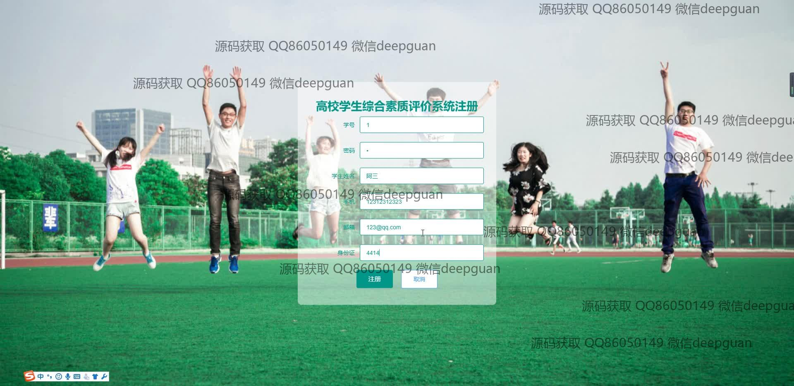
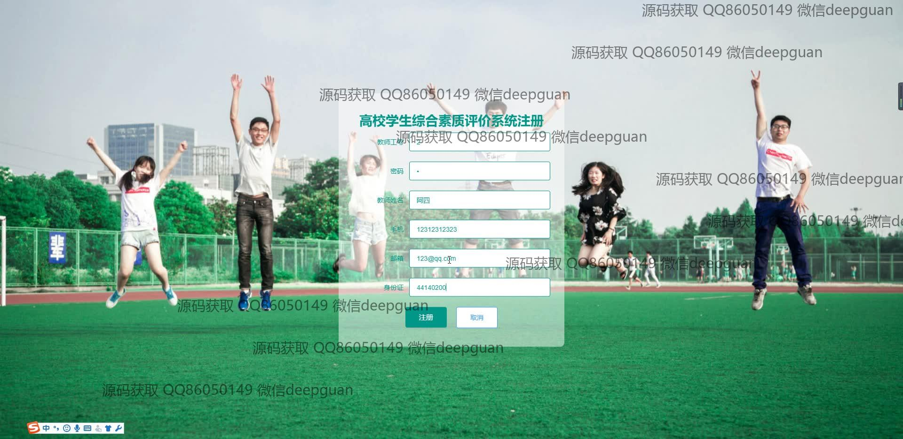
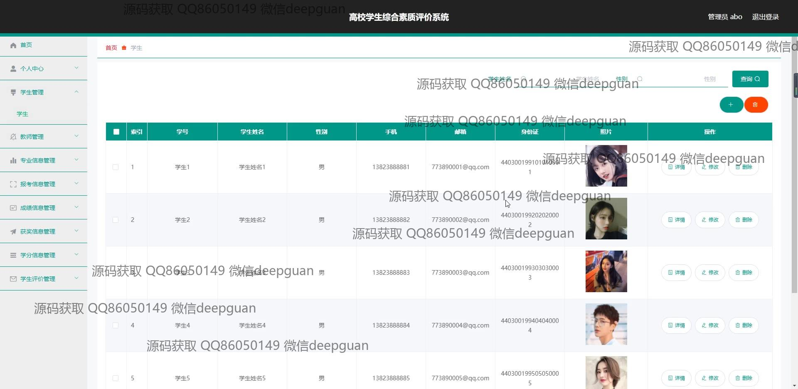
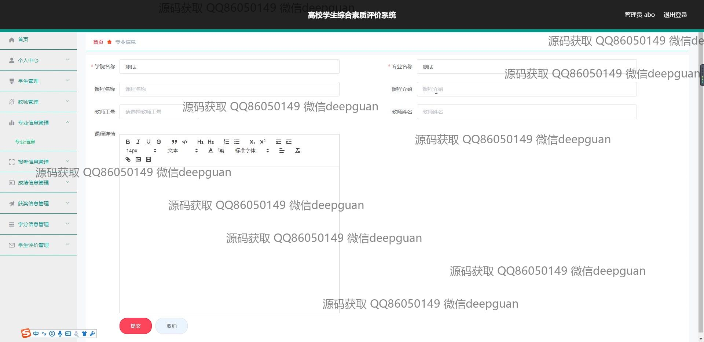
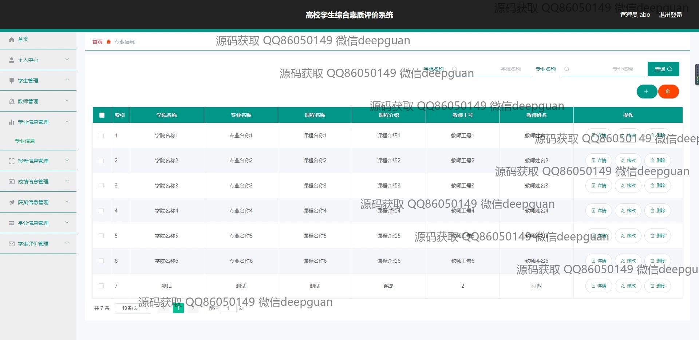
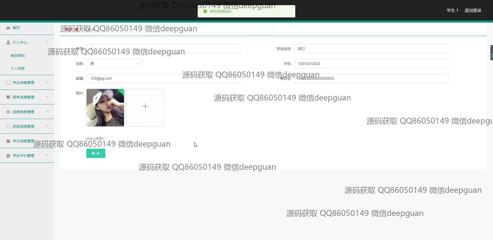
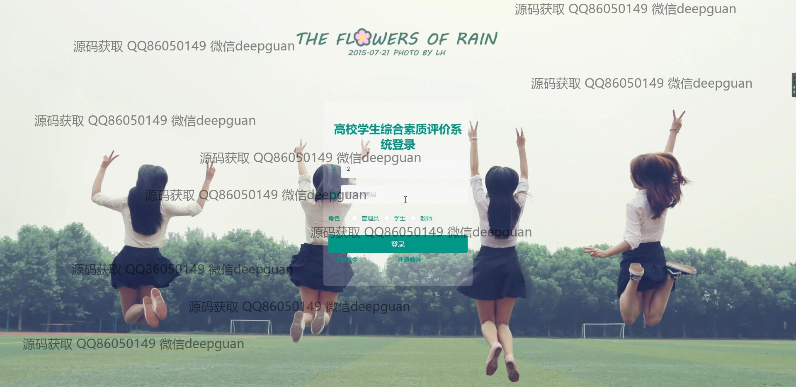
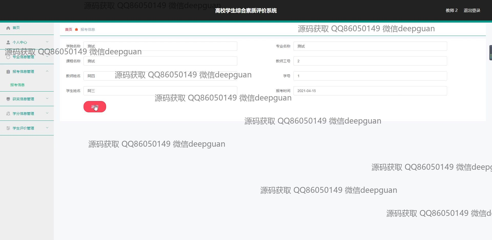
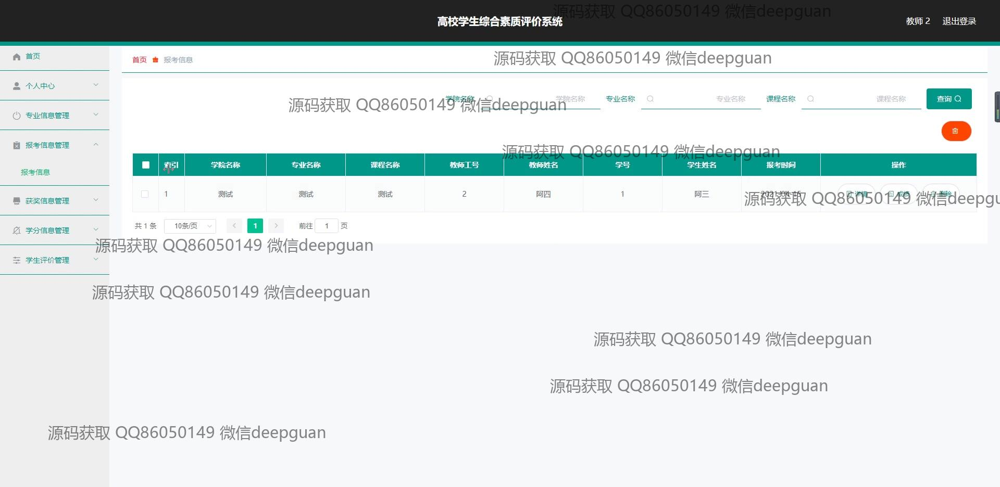
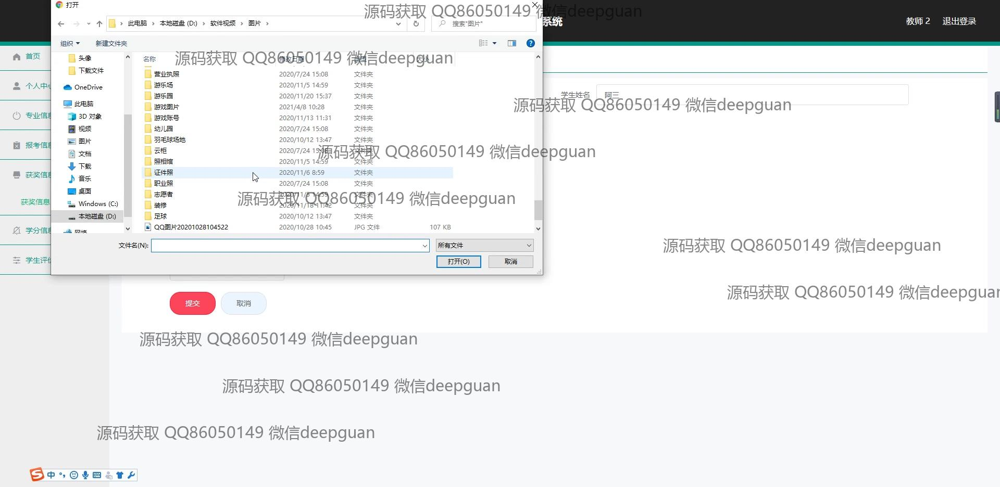
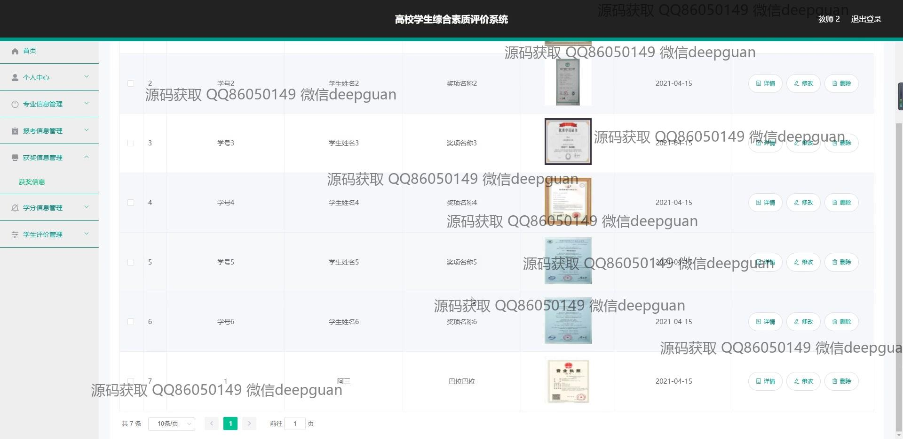
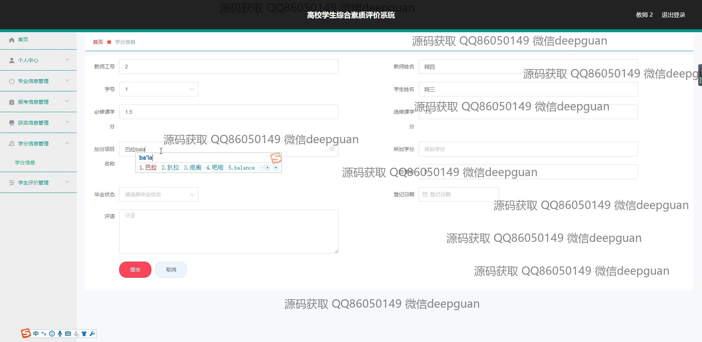
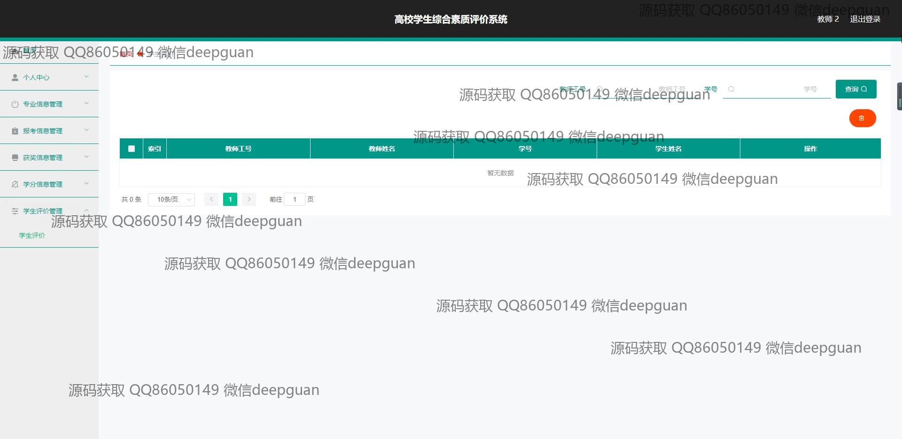
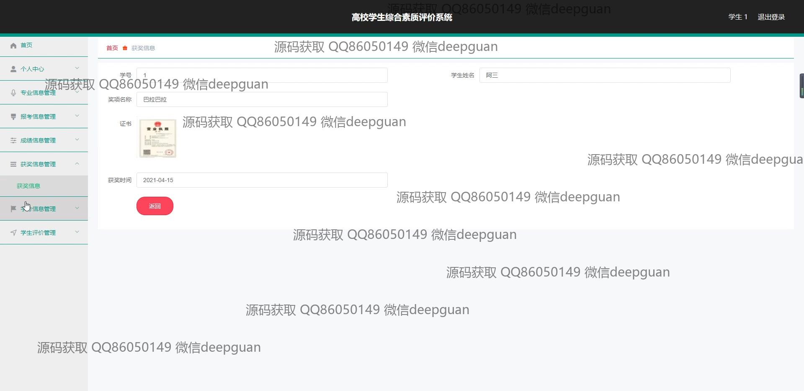
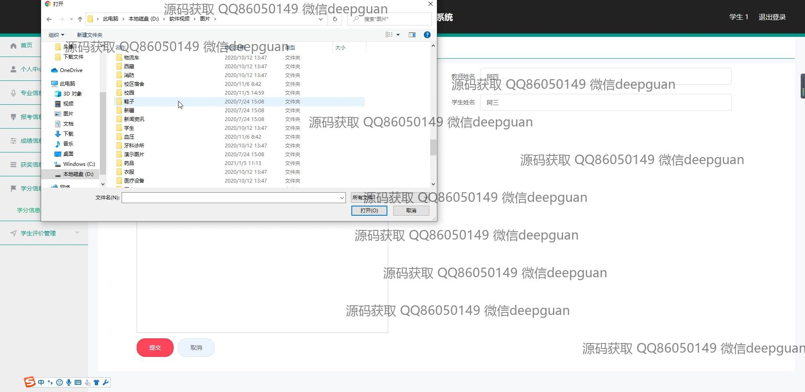
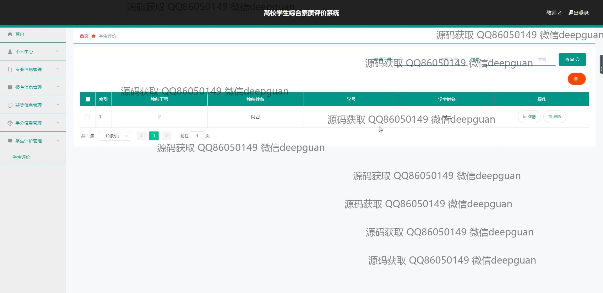
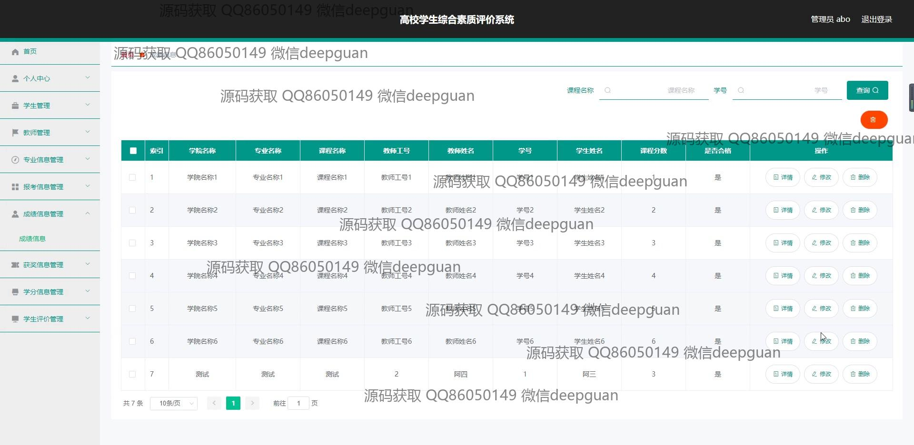
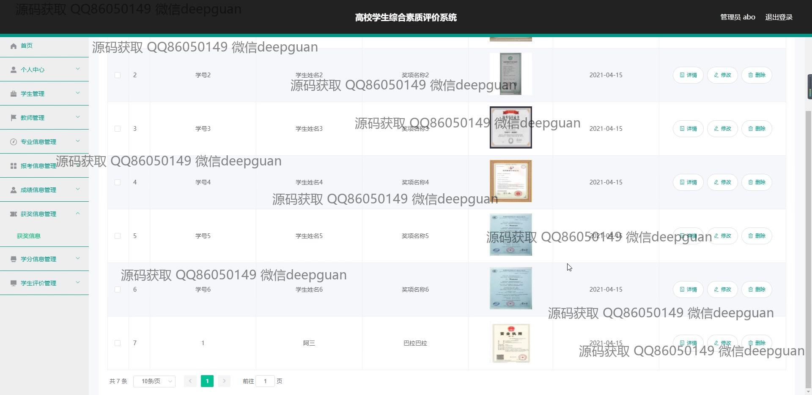
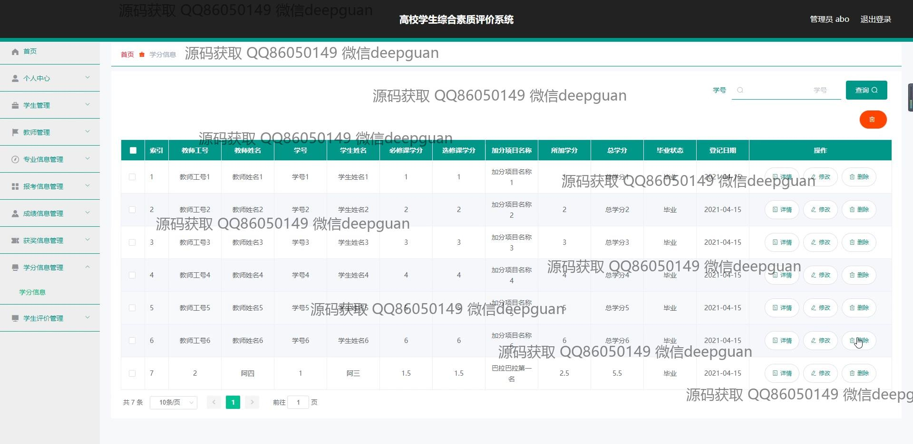

本代码来源于网络,仅供学习参考使用!

